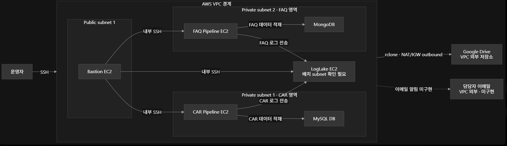
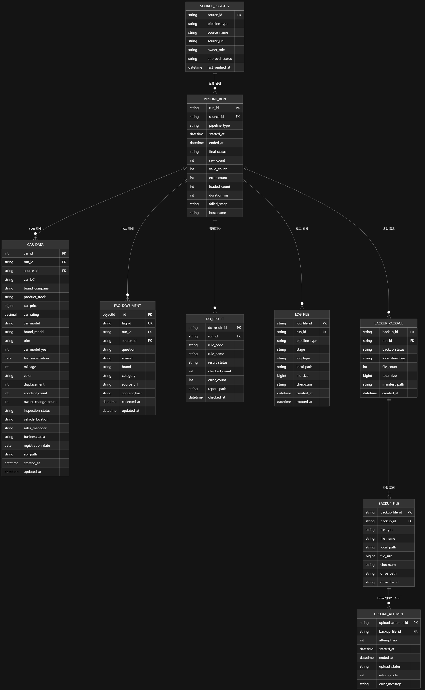

# MLO 1기 1차 프로젝트

## 1. 팀 소개

### 팀명
- 팀명: `mlo-01-p1-team1`

### 멤버
| 이름 | 역할 | GitHub |
|---|---|---|
| 신동엽 | 팀장 | (https://github.com/sdyeob) |
| 김건우 | 팀원 | (https://github.com/natural0448) |
| 이형인 | 팀원 | (https://github.com/LEEHYUNGIN) |
| 조성현 | 팀원 | (https://github.com/seonghyeonjo2) |

## 2. 프로젝트 개요

### 프로젝트 명
- 중고차 구매 가이드

### 프로젝트 소개
- 월별 자동차 통계와 FAQ를 사람이 따로 복사·정리하면 실행 범위, 출처, 품질검사와 변경 이력을 같은 방법으로 재현하기 어렵다.

### 프로젝트 필요성(배경)
- 월별 자동차 통계와 FAQ를 사람이 따로 복사·정리하면 실행 범위, 출처, 품질검사와 변경 이력을 같은 방법으로 재현하기 어렵다.

### 프로젝트 목표

1. FAQ 표준화
2. 중고차 구매 고객에게 필요한 FAQ 제공
3. B2C 타겟의 서비스 이용 시간 및 비용

### 프로젝트 서비스 구현 기획

 - `구글스프레드시트 링크` https://docs.google.com/spreadsheets/d/1TrqPm2xzha1V_xdKmStusRf3vyEt0CBVXYBCy8NOoa0/edit?usp=sharing

## 3. 기술 스택

| 구분 | 기술 |
|---|---|
| Language | Python |
| Data | MySQL, MongoDB |
| Collaboration | GitHub |

## 4. WBS 및 요구사항 명세서

### 4.1 WBS

| 담당자명 |
| 작업 항목 | 작업 내용 |
|---|---|
| `신동엽` |  |
| 로그 관리 환경 구축 | EC2별 로그 디렉토리 생성 및 cron·logrotate 기반 로그 순환·보관 정책 구성 |
| 시스템 모니터링 및 알림 구성 | CPU·메모리·디스크 사용량 수집과 임계치 초과 시 Discord 경고 알림 자동화 |
| 중앙 로그 수집 자동화 | DB·Crawler 서버의 시스템·오류·헬스체크 로그를 Log Datalake로 정기 전송하고 전송 완료 파일 삭제 |
| `김건우` |  |
| Google Drive API 인증 환경 구성 | Google Cloud 프로젝트 생성, Drive API 활성화 및 OAuth 2.0 클라이언트 발급 |
| EC2–Google Drive 연동 | 개인 PC에서 OAuth 사용자 인증 후 토큰을 EC2의 rclone에 등록 |
| 로그 백업 경로 검증 |  |
| `이형인` |  |
| 서버 크롤링 기능 구축 | EC2 서버에서 대상 웹 데이터를 주기적으로 수집하고 오류 URL을 처리 |
| 데이터 정제 및 SQL 적재 | 수집 데이터를 정제·검증한 후 SQL 서버에 저장하고 DB 연결 오류 처리 |
| 파이프라인 로그 관리 | 크롤링·DB 적재·헬스체크 결과를 기록하고 logrotate 및 중앙 로그 전송 구성 |
| `조성현` |  |
| 서버 크롤링 기능 구축 | EC2 서버에서 대상 웹 데이터를 주기적으로 수집하고 오류 URL을 처리 |
| 데이터 정제 및 FAQ 적재 | 수집 데이터를 정제·검증한 후 MongoDB 서버에 저장하고 DB 연결 오류 처리 |
| 파이프라인 로그 관리 | 크롤링·DB 적재·헬스체크 결과를 기록하고 logrotate 및 중앙 로그 전송 구성 |

- 요구사항 명세서 추가 업로드 예정

## 6. ERD

## 7. 주요 프로시저

- CAR, FAQ를 파이프 라인 데이터 SQL, MongDB 적재, 실행에 따른 로그 관리, 백업용 서버 구축  

## 8. 수행결과(테스트/시연 페이지)

- 웹 페이지 노출을 위한 속성 값 부여, 실제 웹 페이지 구현, 웹 유료 서비스를 위한 구체적인 목표 구체화 

## 9. 한 줄 회고

| 이름 | 회고 |
|---|---|
| 신동엽 | 주어진 기간동안 관리할 수 있는 프로젝트의 범위를 결정하고, 분업 및 협업하는 과정에 대해서 많이 배울 수 있었습니다. 또한, 효율적으로 AI와 협업하는 방식에 대한 고민의 필요성을 느꼈습니다. |
| 김건우 | 팀 프로젝트를 진행하며, 모든 사람들이 함께 완성하는 과정 자체가 즐거웠고, 코딩 전반에 대한 이해와 학습을 더 많이 해야겠다는 생각을 가지게 되었다. |
| 이형인 | AI에게 100%를 의존해서는 안된다는 걸 몸으로 느꼈습니다. 네트워크와 코드 작성에 대한 이해도가 향상 된 것 같아 많은 걸 배울 수 있었습니다. 팀원들끼리도 잘 협업이 이루어진 것 같아서 즐거웠습니다. |
| 조성현 | AI에 지나치게 의존하지 않기 위해 먼저 직접 코드를 작성한 뒤, 어려운 부분에만 AI의 도움을 받으려고 했습니다. 하지만 기본기가 부족할수록 AI에 의존하게 된다는 것을 깨달았고, 당분간 직접 코드를 작성하며 기본기를 탄탄히 다져야겠다고 다짐했습니다. 또한 이번 프로젝트를 통해 팀원들과 협업하는 방법을 익히고 부족한 부분을 배울 수 있어 매우 뜻깊었습니다. |